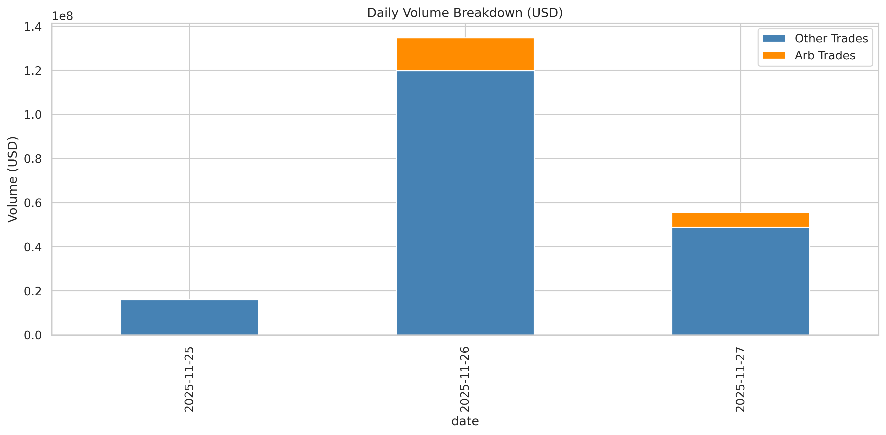
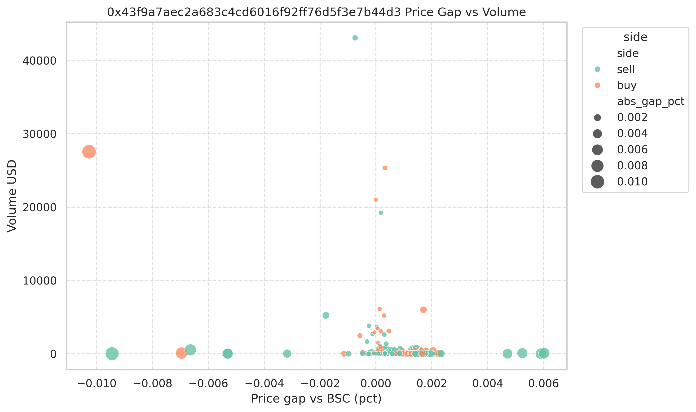
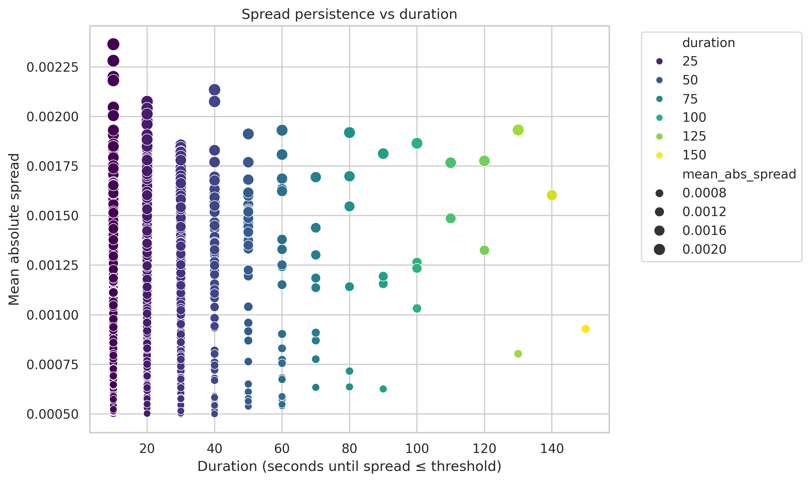

# Cross-chain Arbitrage Assessment

This project studies real-world arbitrage activity between PancakeSwap V3 on BSC and Aerodrome V2 Slipstream on Base. We collect every swap for the ETH/USDC and ETH/USDT pools, load them into SQLite, and run detailed analytics inside `insights/` to understand cross-chain price gaps, trader behavior, and MEV opportunities.

## Runbook

1. **Install the Substreams CLI** following the official guide: <https://docs.substreams.dev/how-to-guides/installing-the-cli>.
2. **Initialize the SQLite databases** by running the Rust helper:
   ```bash
   cargo run --bin initial_db
   ```
   (or trigger the equivalent Substreams CLI pipeline) to seed `data/dex.db`, `data/chains.db`, `data/pools.db`, and `data/transactions.db`.
3. **Stream live data**: use the Substreams CLI to capture Aerodrome (Base) and PancakeSwap (BSC) ETH/USDC|USDT pool events, writing swaps, ticks, gas, and metadata into the SQLite files above.
4. **Set up Python tooling**: activate the repo’s virtualenv and install `insights/requirements.txt` (includes pandas, SQLAlchemy, matplotlib, seaborn, etc.).
5. **Run the analytics**:
   ```bash
   python -m insights.arbitrage_analysis
   ```
   The script now first compares the two pools’ spread trajectories (reporting ≥0.05% deviations), then marks individual trend-following arbitrage trades, aggregates them into competitor/arb-sender leaderboards, matches dual-chain windows, and prints address-level summaries before persisting charts under `insights/view/`.

## Data Pipeline

- Substreams simultaneously ingests swaps from PancakeSwap V3 (BSC) and Aerodrome V2 (Base) for ETH/USDC and ETH/USDT pools.
- Transactions land in `data/transactions.db`; pool metadata stays in `data/pools.db`. `read_transactions` joins these tables and annotates each row with `dex_name` and `chain`.

## Analysis Highlights

1. Analyze the BSC vs. Base pool spread paths first, flagging any trace where `|spread_pct| > 0.05%` along with counts and sample trades.
2. Sort swaps chronologically across chains, continuously align each trade with the latest price from the opposite chain via `pd.merge_asof(direction="backward")`, and mark trades whose price vs. reference exceeds the 0.05% threshold in the arbitrage direction.
3. Build competitor/arb-sender leaderboards from the flagged `is_arb_trade` rows (volume, `net_profit`, spread statistics, etc.).
4. Bucket arbitrage trades into 10-second windows, require both chains to contribute opposite-sided volume, and compute symmetry, high-spread groups, and net-flow metrics.
5. Deep-dive on a specific wallet (`0x43f9a7aec2a683c4cd6016f92ff76d5f3e7b44d3`): enumerate Base trades, compare BSC reference prices, track tick movements, and evaluate whether flipping the signal on the opposite chain would have been profitable.
6. Trace “strict” cross-chain windows that satisfy opposite-side spread constraints on both chains; the current log covers ~1.5 days, yields 10 matched buckets (~1.9% of 10s windows), and highlights three balanced events with nearly $2.1k total net profit despite ETH symmetry ratios near 0.93–1.00.
7. Counted 25,715 high-spread trades (>0.05%) split roughly 13.7k on Base and 12.0k on BSC, removed 19 rows with the anomalous `2954.226369` price, and documented that 139/399 (34.8%) of `0x43f9a7a…` Base trades would have been profitable if reversed on BSC shortly thereafter (avg. next BSC return ≈−0.11%).
8. Added a buffered cross-chain pair matcher (60s window) that exposed 3,427 dual-chain matches, keeps track of per-side gas/volume/price, reports a mean net profit of ~$2.43 (total ≈$8.3k), documents price ranges (~2,985–2,986 USD) and correlations (gas vs. volume ≈0.84, gas vs. profit ≈0.65), and prints the top 20 most profitable pairs (with time differences, windows, prices, and amounts).

### Generated Visuals (`insights/view/`)





## What We Learned

- BSC/Base spreads exist but tend to decay within ~10 seconds unless multiple traders step in; many windowed spreads are never part of a dual-chain pair, yet any persistent spread still creates a short-lived group of actionable swaps.
- Some wallets behave like market makers, continuously responding to spread signals with nearly balanced signed volume and tiny tick impacts—these actors dominate the competitor/arb-sender leaderboards and produce most of the measurable volume.
- Buffering `is_arb_trade` flows for 60s reveals 3,427 cross-chain matches, each recording both sides’ gas, volume, price, and timing. These pairs average ~$2.43 of net profit (≈$8.3k total), show tight price ranges near $2,985–2,986, and exhibit strong correlations between gas/volume (0.84) and gas/profit (0.65), highlighting how liquidity-heavy flows consume more gas yet also make more money.

## Why This Matters

- These traces offer first-hand evidence of cross-chain price formation, reversion speed, arbitrage costs (swap + gas), and market-making behavior.
- The data underpins real-time arbitrage monitors or MEV bot research (price prediction, liquidity readiness).
- The expanding log also provides a practical benchmark: 25,715 high-spread ticks, a 1.90% cross-chain match ratio, just four meaningful competitors, and 139 clearly profitable reverse-BSC opportunities for the studied sender help quantify both the scarcity and the tangible upside of disciplined cross-chain flow matching.
- The same workflow can be extended to new assets/chains or combined with MEV relay/Flashbots quotes to study priority and profitability.

